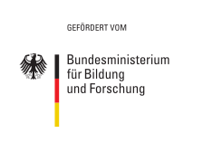

# KBLS: PQC Demonstrator - Security Concept

# Context

Over the course of our work on [KBLS](https://www.forschung-it-sicherheit-kommunikationssysteme.de/projekte/kbls), the latest
advances in post-quantum cryptography have been:

* NIST [selected](https://csrc.nist.gov/News/2022/pqc-candidates-to-be-standardized-and-round-4) Kyber and Dilithium as
  quantum resistent alternatives to today's Public Key Cryptography, e.g. RSA and Elliptic Curves.
* project partners on KBLS have integrated [Kyber](https://github.com/randombit/botan/pull/2872) and [Dilithium](https://github.com/randombit/botan/pull/2973)
  into botan, a C++ crypto library endorsed by the [BSI](https://www.bsi.bund.de/EN/Themen/Unternehmen-und-Organisationen/Informationen-und-Empfehlungen/Kryptografie/Kryptobibliothek-Botan/kryptobibliothek-botan_node.html).

To expand upon this work, neXenio will incorporate the results into an application to demonstrate their applicability in
a real-life scenario. The security concept for this demonstrator is detailed in this repository.

# Versions

* 🇬🇧 English version under [/en](./en)
* 🇩🇪 Deutsche Version unter [/de](./de)

The project on which this concept is based was funded by the German Federal Ministry of Education and Research under the
grant number 16KIS1061. Responsibility for the content of this publication lies with neXenio GmbH.
