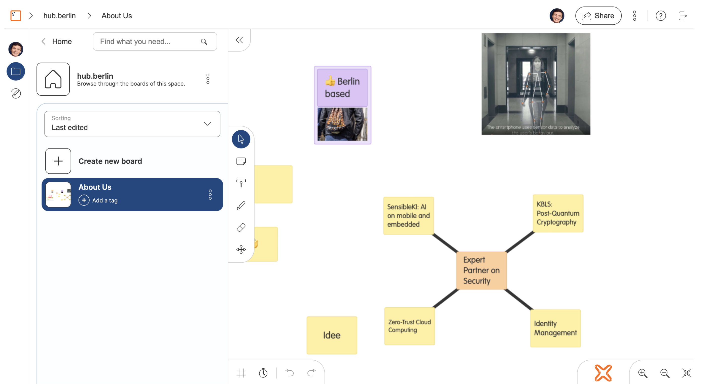

# Kontext und Umfang

## Kontext KBLS

Das Projekt KBLS ist motiviert durch die Notwendigkeit, "neue Quantencomputer-resistente Verfahren in einer Form zur
Verfügung zu stellen, die von möglichst vielen effizient genutzt werden können". Ziel des Projekts ist es, die
Kryptobibliothek botan "um Quantencomputer-resistente Verfahren zu erweitern". Darauf aufbauend sollen Entwickler:innen
"Lösungen umsetzen können, die Angriffen von Quantencomputern widerstehen und somit langfristige Sicherheit der
verarbeiteten Daten garantieren können". Darüber hinaus "wird die Leistungsfähigkeit und Benutzbarkeit der Bibliothek
evaluiert".

Um diese Ziele zu erreichen, soll im Arbeitspaket 13 ein prototypischer Demonstrator entwickelt werden. Der Demonstrator
soll exemplarisch aufzeigen, wie die Ergebnisse aus den vorangegangenen Arbeitspaketen genutzt werden können.
Insbesondere erhoffen wir uns wichtige Einsichten hinsichtlich

* der generellen Bedienbarkeit von botan
* der spezifischen Verwendung von botan für Web Clients
* der Performanz bei Anwendungen mit Echtzeit-Anforderung
* der Realisierung von Krypto-Agilität

Diesbezüglich sind die wichtigsten Ergebnisse aus den vorangegangenen Arbeitspaketen

* Empfehlungen + Implementierung für eine agile Krypto-API (AP2 + AP7)
* Spezifikation eines hybriden Schlüsseleinigungsverfahrens (AP5)
* Implementierung von Kyber (AP8)

## Use Case neXboard

Das System neXboard bietet eine Web-basierte Lösung für digitale Whiteboards. Ein Board umfasst folgende
Funktionalitäten:

* Erstellung von Post-its
* Upload von Bildern
* Verknüpfung mehrerer Post-its oder Bilder

Die Größe sowie Position von Post-its und Bildern können verändert werden. Bei Post-its können darüber hinaus die
Farbe und der Inhalt verändert werden. Die Inhalte eines Boards können von mehreren Nutzer:innen gleichzeitig bearbeitet
werden.

Registrierte Nutzer:innen können Boards erstellen und mit anderen Nutzer:innen teilen. Die Zugriffsrechte für ein Board sind
konfigurierbar: Eine Einladung kann Zugriffe zum Lesen oder zum Schreiben erlauben. Einzelne Boards können außerdem per
"public link" geteilt werden, welcher auch ohne neXboard-Registrierung zugänglich ist.

## Schutzziele

Der Demonstrator soll zeigen, dass die Ergebnisse aus vorangegangenen Arbeitspaketen dafür verwendet werden können, die
Inhalte eines Boards vor Angriffen durch Quantencomputer zu schützen. Daraus leiten sich zwei konkrete Schutzziele ab:

* Vertraulichkeit:
  * Der Inhalt aller Post-its auf einem Board darf nur für autorisierte Nutzer:innen zugänglich sein
  * Weiter sollen jegliche Inhalte für den Server nicht standardmäßig lesbar sein
* Integrität:
  * Veränderungen am Inhalt eines Post-its können nur durch autorisierte Nutzer:innen durchgeführt werden
  * Insbesondere wird nur die Integrität jedes einzelnen Post-its geschützt, nicht die des gesamten Boards

Autorisierte Nutzer:innen erhalten Zugriff auf alle Inhalte seit Erstellung eines Boards (keine backward secrecy).
Zugriffsrechte sollen aber entzogen werden können, damit Inhalte ab diesem Zeitpunkt nicht weiter zugänglich sind
(forward secrecy).

Die Maßnahmen, die dafür getroffen werden, müssen diese Ziele in ihrer Gesamtheit erfüllen. Wenn eine der Maßnahmen
anfällig ist für einen praktikablen Angriff oder eine Maßnahme fehlt, um einen vollständigen Schutz zu gewährleisten,
dann ist das Schutzziel nicht erfüllt.

## Vereinfachende Annahmen

* Server ist "honest-but-curious"[^1], das heißt er wird nicht aktiv versuchen die Kommunikation zu verändern, ihm wird aber
nicht bezüglich der Vertraulichkeit vertraut. Insbesondere auch:
  * Integrität der Client-Applikation: Der Server liefert das Frontend unverändert aus und verändert nicht die für die Clients
  gespeicherten Daten
  * Vollständigkeit: Dem Server wird vertraut, keine Post-its zu unterschlagen
* Verfügbarkeit: der neXboard-Server ist hochverfügbar
* Sicherheit kryptografischer Primitive: AES-256, SHA-256 und Kyber sind bis zu einem ausreichenden Sicherheitslevel quantenresistent

## Nicht-Ziele

Um die Grenzen der Schutzziele aufzuzeigen, benennen wir außerdem Einschränkungen des Systems, die bewusst ungeschützt
bleiben. Die Alternative, diese Einschränkungen auszuschließen, ist nur mit anderen Einschränkungen realisierbar, die
etwa die Wartbarkeit, Bedienbarkeit oder Performanz des Systems betreffen. Einzelne Nicht-Ziele können später in Ziele
geändert werden, dies hat allerdings weitreichende Folgen und erfordert teils signifikante Anpassungen am Konzept.

* Es werden keine besonderen Maßnahmen getroffen, um gegen einen aktiv angreifenden Applikationsserver zu verteidigen
* Die Vertraulichkeit und Integrität des gesamten Boards wird nicht sichergestellt, insb. betrifft dies die Metadaten von 
  Post-its (Position, Größe, Farbe, Verknüpfungen, Version)
  * Der Server kann also bspw. Post-its verschieben oder alte Post-its anzeigen
* Keine Authentizität oder Deniability: Die eindeutige Urheberschaft eines Post-its muss nicht sichergestellt werden
  * Nutzer:innen haben also keine Möglichkeit zu bestimmen oder abzustreiten, wer ein bestimmtes Post-it verfasst hat
  * Nutzer:innen haben außerdem keine Möglichkeit zu bestimmen oder abzustreiten, wer einen bestimmten Board Key ausgestellt
    hat
* Keine Backward Secrecy: eingeladene Nutzer:innen erhalten Einsicht auf alle bisher geteilten Daten
* Keine Forward Secrecy: wenn ein Angreifer Zugriff auf einen Board Key erhält, erhält er damit Zugriff auf alle
  Post-it-Inhalte, die unter diesem Board Key verschlüsselt werden.

[^1]: Bezüglich allen Daten außer dem Passwort. Aufgrund des bisherigen Aufbaus von neXboard müssen sich Nutzer
mit Nutzername und Passwort am Server anmelden. Im beschriebenen System nimmt das Passwort aber auch eine sicherheitskritische
Rolle beim Zwischenspeicher von privaten Nutzerschlüsseln ein. Daher wird der neXboard-Server tatsächlich durch zwei Server
implementiert: einen Auth-Server, der das Nutzerpasswort beim Login erhält, und den Applikationsserver, welcher das Nutzerpasswort
nie erhält. Unter der Annahme eines ehrlichen Auth-Servers (Angriffsoberfläche ist geringer, da kein Nutzerinput außer UserID
und Passwort verarbeitet wird und nur Login-Funktionalität umgesetzt werden muss), gilt für den Applikationsserver das erwähnte
Angriffsmodell eines passiven (honest-but-curious) Angreifers. Damit wird ein stärkeres Angriffsmodell abgesichert als im
Normalfall des nicht hybriden neXboards, in welchem beide Komponenten des Servers als ehrlich betrachtet werden müssen.
