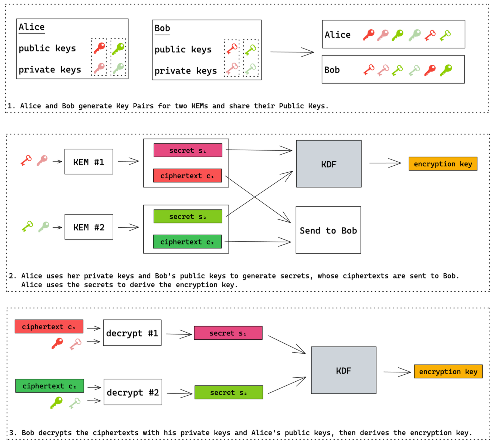

# Vorgesehene Architektur

## Client-Server Modell
Wir verwenden ein einfaches Client-Server Modell, wobei der Server lediglich zum Speichern und Abrufen aller notwendigen 
Informationen dient. Die Business Logik erfolgt überwiegend clientseitig, Ver- und Entschlüsselung erfolgt ausschließlich 
clientseitig. Es gibt beliebig viele Clients und einen Server, über den sich die Clients austauschen.

Weitere Mechanismen wie Authentifizierung und Authorisierung, Caching, Pagination und Hochverfügbarkeit können ergänzt 
werden, um Zugriffsrechte feingranular zu definieren und die Performanz zu verbessern.

## Hybrides Schlüsseleinigungsverfahren

Für den Demonstrator wird ein hybrides Schlüsseleinigungsverfahren umgesetzt basierend auf der Kyber-Implementierung für 
botan. Darüber hinaus muss das Schlüsselmaterial, das hierfür zum Einsatz kommt, auf geeignete Weise geschützt werden.

Ergebnis des hybriden Schlüsseleinigungsverfahrens ist, dass zwei Kommunikationspartner Alice und Bob Schlüsselmaterial 
ausgetauscht haben. Dieses Verfahren ist generisch konzipiert, d.h. es kann für verschiedene Use Cases verwendet werden.

Im Kontext von neXboard wird dieses Schlüsselmaterial dafür verwendet, einen sogenannten Board key zu verschlüsseln. Der 
Board key wiederum wird verwendet, um die Inhalte aller Post-Its im Board zu schützen. Der Board key ist also ein data 
encryption key (DEK), weil dieser Daten verschlüsselt. Das zwischen Alice und Bob ausgetauschte Schlüsselmaterial ist 
ein key encryption key (KEK), weil dieser den (data encryption) key verschlüsselt.

### Motivation

Die Motivation für das KBLS-Projekt ist, dass klassische Verfahren basierend auf RSA oder Elliptischen Kurven nicht 
quantenresistent sind - dies wird im Laufe der nächsten Jahre zunehmend zum Sicherheitsrisiko. Auf der anderen Seite 
sind die bisher entwickelten quantenresistenten Verfahren noch nicht produktiv erprobt - es könnte sich also im Laufe 
der nächsten Jahre herausstellen, dass es praktikable Angriffe gibt. Darüber hinaus sind die quantenresistenten 
Verfahren nicht derart gestaltet, dass die klassischen Verfahren direkt ausgetauscht werden können.

Daraus ergibt sich die Notwendigkeit, ein gänzlich neues Schlüsseleinigungsverfahren zu verwenden. Die Idee eines 
hybriden Schlüsseleinigungsverfahrens erfüllt mehrere Zwecke:
* die Möglichkeit ein Verfahren tatsächlich direkt auszutauschen
* die beste Sicherheit von zwei Verfahren über einen längeren Zeitraum zu erhalten

Dies bewerkstelligt zum einen, dass die unbekannt lange Übergangsphase von klassischen zu quantenresistenten Verfahren 
abgesichert ist: während die Verwendung von RSA über die Zeit an Sicherheit verliert, gewinnt die Verwendung von Kyber 
über die Zeit an Sicherheit. Das liegt daran, dass die Sicherheit von Verfahren darauf basiert, dass keine Möglichkeit 
bekannt ist, sie zu brechen. Je länger daran geforscht wird, die Sicherheit eines Verfahrens zu brechen, ohne dass 
signifikante Angriffe bekannt werden, desto sicherer können wir in der Annahme gehen, dass dies so bleibt.

Zum anderen sind wir durch den Wechsel auf ein hybrides Schlüsseleinigungsverfahren dazu in der Lage, eins der Verfahren 
später auszutauschen. Beispielsweise könnte sich herausstellen, dass Kyber unsicher ist, aber sich ein anderes 
quantenresistentes Verfahren wie McEliece bewährt hat. Wenn wir ein hybrides Verfahren aus RSA und Kyber verwenden und 
zu dem Zeitpunkt, an dem Kyber kompromittiert wird, RSA weiterhin sicher ist, können wir Kyber austauschen gegen 
McEliece ohne Einbußen bei der Sicherheit oder technischen Machbarkeit.

### Ablauf

Der Ablauf für das vorgesehene hybride Schlüsseleinigungsverfahren ist wie folgt:
1. Zwei Kommunikationspartner Alice und Bob haben zwei Schlüsselpaare, bestehend aus einem öffentlichen Schlüssel 
   (public key) zugänglich für beide und einem geheimen Schlüssel (private key), der nur ihnen bekannt ist:
   * ein Schlüsselpaar für ein klassisches Verfahren, bspw. RSA
   * ein Schlüsselpaar für ein quantenresistentes Verfahren, bspw. Kyber
2. Alice benutzt Bobs öffentliche Schlüssel, um jeweils ein Geheimnis zu generieren und verschlüsseln. Dieser 
   Mechanismus wird als Key-Encapsulation-Mechanism (KEM) bezeichnet. Alice kann darüber hinaus zusätzlich zu Bobs 
   öffentlichen Schlüsseln auch ihre geheimen Schlüssel verwenden, um Authentizität für die verschlüsselten Geheimnisse 
   zu bewirken. Die verschlüsselten Werte schickt Alice an Bob. Aus den Geheimnissen leitet Alice mittels einer 
   sogenannten Key-Derivation-Function (KDF) den encryption key ab, den sie für die spätere Kommunikation mit Bob 
   verwenden wird.
3. Bob verwendet seine geheimen Schlüssel, um die verschlüsselten Geheimnisse von Alice zu entschlüsseln. Falls Alice 
   die Verschlüsselung authentifiziert hat, verwendet Bob zusätzlich die öffentlichen Schlüssel von Alice. Anschließend 
   leitet auch Bob aus den entschlüsselten Geheimnissen mittels der selben KDF den encryption key ab.

Die untenstehende Grafik veranschaulicht diesen Prozess:

Quellen
* https://neilmadden.blog/2021/02/16/when-a-kem-is-not-enough/
* Kapitel 3.1 der Ausgabe "Kryptografie quantensicher gestalten" des BSI (15.12.2021) 
* Java-Implementierung: https://github.com/neXenio/kbls-pqc-demonstrator-client

## Schutz des Schlüsselmaterials

### Benötigtes Schlüsselmaterial
Für das hybride Schlüsseleinigungsverfahren werden für jeden Nutzer wie oben beschrieben zwei Schlüsselpaare benötigt. 
Das Ergebnis dieses Verfahrens ist ein verschlüsselter KEK, der im Kontext von neXboard spezifisch für den Empfänger 
ist. Der KEK ist bereits ausreichend geschützt, weil dieser nur durch das Wissen der private keys ermittelt werden kann.

### Schutzkonzept
Public keys müssen nicht geschützt werden und können daher zentral beim Server gespeichert werden. Dadurch können zudem 
alle Nutzer Zugriff auf die public keys anderer Nutzer erhalten.

Private keys müssen geschützt werden. Eine Option besteht darin, die private keys lokal bei den Nutzern zu speichern. 
Für bessere Usability werden die private keys stattdessen verschlüsselt beim Server gespeichert. Der symmetrische 
Schlüssel für diese Verschlüsselung leitet sich aus dem Passwort des Nutzers sowie zusätzlicher Entropie ab. Konkret 
wird hierfür folgender Prozess durchgeführt:
1. `encryption_key = pbkdf2(user_password, salt)`
2. `encrypted_secret_key = aes256gcm(secret_key, encryption_key, sha256(public_key))`

Bemerkungen:
* Die zum Einsatz kommenden kryptographischen Funktionen sind PBKDF2, AES-256 im GCM-Mode sowie SHA-256
* Der Wert `salt` besteht aus 16 bytes, die von einem geeigneten Zufallszahlengenerator erstellt wurden, und wird 
  gemeinsam mit `encrypted_secret_key` beim Server gespeichert
* der Wert `sha256(public_key)` wird auf 12 bytes gestutzt, um der empfohlenen Größe für AES-GCM zu entsprechen

## Schutz der Post-It Inhalte im neXboard

Die Inhalte der Post-Its werden unter dem aktuellen Board key verschlüsselt. Jedes Post-It hat eine eindeutige ID 
`postit_id` und jede Änderung des Post-Its ist mit einem eindeutigen Zeitstempel ts versehen, die für die Ableitung 
eines IVs für die Verschlüsselung verwendet werden kann:
* `encrypted_postit_content = aes256gcm(postit_content, board_key, sha256(postit_id + ts))`
