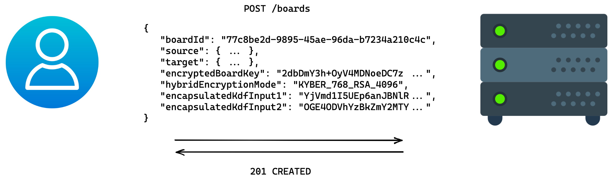

# API Spezifikation + User Flows

Die folgenden User Flows beschreiben, wie die Clients mit dem Server interagieren. Hierfür werden beispielhafte Endpunkte
und DTOs verwendet.

> Im Folgenden wird für hybride Schlüsselpaare der Einfachheit halber angenommen, dass sie aus einem
> Kyber-Schlüsselpaar und einem RSA-Schlüsselpaar bestehen.
>
> Die Mechanismen sind so konzipiert, dass Kyber durch ein anderes quantenresistentes Verfahren ersetzt werden kann
> (bspw. McEliece) und RSA durch ein anderes klassisches Verfahren ersetzt werden kann (bspw. eine geeignete
> Elliptic-Curve-Variante). Technisch lässt sich auch RSA mit EC kombinieren, aber dies hat keinen praktischen Nutzen in
> Bezug auf die Quantencomputerresistenz.

## Nutzer registrieren

Am bestehenden Prozess der Nutzerregistrierung ändert sich nichts. Für die beschriebenen Funktionalitäten müssen aber
für alle Nutzer:innen je zwei Schlüsselpaare registriert werden. Die Verknüpfung erfolgt über die User ID, die bei der
Registrierung festgelegt wird (bspw. die E-Mail-Adresse).


## Schlüsselpaare registrieren

Alle Nutzer:innen benötigen für die beschriebenen Funktionalitäten zwei Schlüsselpaare, die clientseitig generiert und
serverseitig persistiert werden. Jedes Schlüsselpaar enthält einen privaten Schlüssel, der clientseitig verschlüsselt
wird, damit er serverseitig nicht ausgelesen werden kann.

Dieser Prozess wird auch verwendet, um alte Schlüsselpaare durch neue abzulösen. Soll beispielsweise ein RSA-Schlüsselpaar
durch ein EC-Schlüsselpaar abgelöst werden, wird das aktuelle Kyber-Schlüsselpaar zusammen mit dem neuen EC-Schlüsselpaar
registriert. Zu beachten ist hierbei jedoch, dass aufgrund ihrer Natur die Schlüsselpaare jeweils nur mit der exakt gleichen
Kombination auf der Empfängerseite kommunizieren können. Ein vollständiger Wechsel benötigt daher eine Generierung neuer
Schlüssel aufseiten aller Kommunikationspartner:innen. Eine einseitige Willenserklärung einen neuen Schlüssel zu verwenden
kann dadurch jedoch abgegeben und von einzelnen, kryptografisch kompatiblen Kommunikationspartner:innen honoriert werden.

Der genaue Prozess, wie diese Rotation im Falle einer signifikanten Verschlechterung des Schutzniveaus (etwa im Fall eines
neuen mathematischen Durchbruchs) schnell praktisch umgesetzt werden kann, ist nicht Teil dieses Konzepts. Auf dieselbe
Weise können technisch auch beide Schlüsselpaare gleichzeitig abgelöst werden.

1. Schlüsselpaare und Salts für die Schlüsselableitung generieren.

```python
# Kyber
kyber_keypair            = Kyber.gen_keypair()
kyber_public_key_base64  = kyber_keypair.public # e.g. MIIFQzCBlwYJKoZIhvcNAQMBMIGJ...
kyber_private_key_base64 = kyber_keypair.private # e.g. MIIKBQIBADCBlwYJKoZIhvcNAQM...
kyber_encryption_salt    = random_bytes(16) # e.g. jv/DRgVf5WW5d5BTCyozOQ==

# RSA
rsa_keypair              = RSA.gen_keypair()
rsa_public_key_base64    = rsa_keypair.public # e.g. MIICIjANBgkqhkiG9w0BAQEFAAOC...
rsa_private_key_base64   = rsa_keypair.private # e.g. MIIJRAIBADANBgkqhkiG9w0BAQE...
rsa_encryption_salt      = random_bytes(16) # e.g. asdDRgVf5orcs5BTCyodea==
```

2. Symmetrische Schlüssel für die Verschlüsselung privater Schlüssel aus dem Nutzerpasswort und Salt ableiten.

```python
encryption_key        = pbkdf2(password, "encryptPrivateKeys" || encryption_salt)
iv                    = sha256(public_key)
encrypted_private_key = aes256gcm.encrypt(private_key, encryption_key, iv)
```

> Erklärungen:
> * Die Berechnung erfolgt jeweils für Kyber und RSA mit den spezifischen Schlüsseln und Salts.
> * Die zum Einsatz kommenden kryptografischen Funktionen sind PBKDF2, AES-256 im Galois-Counter-Modus (AES-GCM) sowie SHA-256.
> * Der Wert `password` wird von der Nutzer:in bestimmt und ist unabhängig vom Nutzerpasswort, das beim Login verwendet wird.
> * Der Wert `encryption_salt` besteht aus 16 Bytes, die von einem geeigneten Zufallszahlengenerator erstellt wurden, und wird
>   gemeinsam mit `encrypted_private_key` beim Server gespeichert.
> * Der konstante String `"encryptPrivateKeys"` wird genutzt, um eine Domänenseparierung zu gewährleisten, damit ein zum Beispiel
>   beim Auth-Server gespeicherter PBKDF2-Passworthash nicht dem symmetrischen `encryption_key` entspricht. Dazu wird der
>   String mit dem Salt konkateniert (`||`).
> * Der Wert `sha256(public_key)` wird auf 12 Bytes gestutzt, um der empfohlenen Größe für AES-GCM zu entsprechen.

> Bemerkungen:
> * Dieser Ansatz erlaubt einen Offline-Angriff auf das `password` durch den Server oder jemanden, der den Server 
>   kompromittiert. PBKDF2 sollte so konfiguriert werden, dass solche Angriffe besonders ineffizient werden (bspw. durch 
>   mindestens 100.000 interne Iterationen - lieber noch mehr). Darüber hinaus sollten Nutzer:innen dazu angehalten werden, 
>   sichere Passwörter zu verwenden (keine Wiederverwendung, hohe Entropie). Nicht zuletzt ist ein wichtiger Schutzmechanismus
>   an dieser Stelle das Vertrauen, dass der Server nicht bösartig handelt und vor Angriffen geschützt ist.
> * Der Wert `encryption_salt` ist erforderlich, um eine Vorberechnung der zu schwachen Passwörtern zugehörigen Schlüssel
>   zu verhindern. Um einen sicheren Wechsel des Passworts zu gewährleisten, wird bei einem Passwortwechsel auch das Salt neu
>   gewählt.
> * Der Wert `encryption_salt` ist aus kryptografischer Sicht unpräzise benannt: Das Salt wird für PBKDF2 verwendet, nicht für 
>   die Verschlüsselung. Das Verschlüsseln bedingt aber PBKDF2 und damit das Salt.

3. Ergebnis als DTO encodieren (beispielhaft für Kyber).

```json
{
  "publicKey": {
    "publicKeyAlgorithm": "KYBER",
    "pkBase64": "MIIFQzCBlwYJKoZIhvcNAQMBMIGJ..."
  },
  "encryptedPrivateKey": {
    "skEncryptionAlgorithm": "AES_256_GCM_PBKDF2",
    "skCiphertext": "Rez0G6dTXc/Z6p7a9SB0noCR...",
    "skEncryptionSalt": "jv/DRgVf5WW5d5BTCyoz..."
  }
}
```

4. Key Pair DTOs mit User ID aggregieren und an den Server schicken


## Board erstellen

Die Erstellung eines Boards erfordert die Erstellung eines Board Keys und dessen Verschlüsselung. Die Person, die
dieses Board erstellt, teilt das Board gewissermaßen mit sich selbst. Im oben beschriebenen hybriden
Schlüsseleinigungsverfahren nimmt diese Person die Rollen von Alice und Bob ein.

1. Board ID (UUID Version 4) und Board Key generieren (32 zufällige Bytes).

```python
board_id  = UUID.random()
board_key = random_bytes(32)
```

2. Erstes Geheimnis mit Kyber erstellen und verschlüsseln.

```python
kyber_kem_result     = Kyber.encapsulate(kyber_private_key_user, kyber_public_key_user)
secret1              = kyber_kem_result.secret
encapsulated_secret1 = kyber_kem_result.encapsulated_secret
```

3. Zweites Geheimnis mit RSA erstellen und verschlüsseln.

```python
rsa_kem_result       = RSA.encapsulate(rsa_private_key_user, rsa_public_key_user)
secret2              = rsa_kem_result.secret
encapsulated_secret2 = rsa_kem_result.encapsulated_secret
```

4. Board Key verschlüsseln.

```python
key_encryption_key  = hkdf(secret1 || secret2, "aes-key")
encrypted_board_key = aes256kw.encrypt(board_key, key_encryption_key)
```

> Erklärungen:
> * Die zum Einsatz kommenden kryptografischen Funktionen sind HKDF und AES-256 im Key-Wrap-Modus (KW).
> * Die zu `secret1` und `secret2` korrespondierenden byte-Arrays werden konkateniert (`||`).

> Anmerkungen:
> * HKDF erhält als Parameter `salt` ein leeres byte-Array, weil die Inputs nur hier verwendet werden. Als Parameter `info`
>   erhält HKDF den Wert `"aes-key"` zur Domänenseparierung.

5. IDs für die öffentlichen Schlüssel erstellen.

```python
id1 = sha256(kyber_public_key_user)
id2 = sha256(rsa_public_key_user)
```

6. Ergebnis als DTO encodieren.

```json
{
  "boardId": "77c8be2d-9895-45ae-96da-b7234a210c4c",
  "source": { "id1": "59ec81ac05fdc91...", "id2": "06fafdfcc94157d..." },
  "target": { "id1": "59ec81ac05fdc91...", "id2": "06fafdfcc94157d..." },
  "encryptedBoardKey": "mW4mDrwpDcSvOBEDgBzN7DGKLd+FtRZViAIrDUCe3RTxNILBpv1kWQ==",
  "hybridEncryptionMode": "KYBER_768_RSA_4096",
  "encapsulatedKdfInput1": "MIIE4zCBlwYJKoZIhvcNAQMBMIGJAkEA...",
  "encapsulatedKdfInput2": "b5fwR9PJzjrA6TEx9ukiUXxvCSZp2h2e..."
}
```

7. Board Encryption Data DTO an den Server schicken

<!-- https://excalidraw.com/#json=_Gr_3et1YlCPk8a0_dK7O,tsi_E4CB4UnCOKEBGRU3Dw -->


## Board bearbeiten

Sobald ein Board erstellt oder geöffnet ist, liegt die Board ID sowie der Board Key vor. Der IV für die Verschlüsselung des
jeweiligen Post-it-Inhalts wird zufällig vom Client bestimmt. Jedes erstellte Post-it erhält eine eindeutige ID. Jede Änderung
an einem Post-it wird mit einem aktuellen Zeitstempel versehen.

Weil sich der Board Key im Laufe der Zeit ändern kann, wird zudem der Board Key referenziert, mit dem der Post-it-Inhalt
verschlüsselt wurde.

Änderungen können in Batches an den Server geschickt werden.

1. Post-it-Inhalt:

```python
# given: board_key, postit_id, postit_content
timestamp                = now()
iv                       = random_bytes(12)
encryption_key           = hkdf(board_key, "ENC")
authentication_key       = hkdf(board_key, "AUTH")
encrypted_postit_content = aes256ctr.encrypt(postit_content, encryption_key, iv)
encryption_mac           = hmac(encrypted_postit_content, authentication_key)
board_key_id             = sha256(board_key)
```

> Anmerkungen:
> * `"ENC"` und `"AUTH"` sind die Werte für den HKDF-Parameter `info`.

2. Ergebnis als DTO encodieren.

```json
{
  "objectId": "05402bfa9ff8bb20df8f29776e32c80c51b8fda88e1216b09fa54b5c9c5b3fd7",
  "timestamp": 1669823977123521245,
  "dataEncryptionMode": "AES_256_CTR_HMAC_SHA256",
  "iv": "GBkdJP3GdbjAsa49",
  "ciphertext": "6Qe3UMxK7RBvr4Md9kV2+2VW2I3tsoAIaSci8nrZ/bp8HfLL4VG2zQ==",
  "mac": "22eb68c574d53a83c984c785a94680130b4f94bfd530167c993b3db83f8aa1b1",
  "boardKeyId": "cf5a8d5983625d5b3c662a843720aa387d41e8a9d8d4964d1e72a24021ce32f0"
}
```

> Die `objectId` ist die ID des Post-its und wird vom Client bestimmt. Diese kann entweder eine UUID sein oder ein 
> geeigneter Hash-Wert, bspw. aus der Konkatenation von `iv` und `mac` bei der ersten Erstellung des Post-its. Der Vorteil 
> des Hash-Werts ist, dass dieser einen [natürlicher Schlüssel](https://en.wikipedia.org/wiki/Natural_key) darstellt. 
> Im Gegensatz dazu stellt die UUID einen [künstlichen Schlüssel](https://en.wikipedia.org/wiki/Surrogate_key) dar.

3. Änderungen aggregieren und an den Server schicken.
<!-- https://excalidraw.com/#json=2Pcid6KT0qRRxur-rGujX,cw6Gc_DXPH9AWOQqwk2G2w -->


> Der Endpunkt `/events/{boardId}` wird verwendet, um Post-it-Inhalte an den Server zu schicken. Jede Erstellung oder
> Änderung eines Post-its wird als Event modelliert. Es können mehrere Events gleichzeitig an den Server geschickt werden,
> um die Netzwerkverbindung effizienter zu benutzen ("batching"). 
> 
> Wichtig ist hier, dass der Zeitstempel möglichst präzise oder zumindest ehrlich gegenüber den anderen Board-Teilnehmer:innen 
> bestimmt wird, da über den Zeitstempel die Reihenfolge der Events bestimmt werden kann. Letztlich ist es allerdings
> die Entscheidung des Servers, ob etwa
> * alle Events gespeichert und anhand ihres Zeitstempels sortiert werden oder
> * nur das Event gespeichert wird, welches der Server zuletzt erhalten hat ("last write wins") oder
> * die `objectId` quasi als Parent-ID verwendet wird, sodass Ketten (bzw. Bäume) von Events modelliert werden.

## Board öffnen

Voraussetzung für eine Nutzerin Alice, ein Board zu öffnen, ist, dass das Board erstellt und mit Alice geteilt wurde.
Wir nehmen der Einfachheit halber an, Alice hat das Board selber erstellt und damit bereits mit sich selbst geteilt.
Zur besseren Veranschaulichung dieses Prozesses nehmen wir zudem an, dass Alice den Client seitdem neu gestartet hat
und lediglich ihre Zugangsdaten kennt.

Um das Board zu öffnen, muss zuerst der Board Key entschlüsselt werden. Dazu sind einerseits die privaten Nutzerschlüssel
erforderlich und andererseits der verschlüsselte Board Key. Alice holt sich beides vom Server:

1. Hybriden Schlüsselpaare beim Server abrufen.

<!-- https://excalidraw.com/#json=CQsHUH2fqRvj5dkWqDrfb,XwEv0EoCLbBJSYJUYGpoAw -->


```python
user_id_alice               = "alice@acme.com"
hybrid_key_pair             = request("GET", "/keys/{user_id_alice}")
kyber_public_key            = hybrid_key_pair.keyPair1.publicKey.pkBase64
encrypted_kyber_private_key = hybrid_key_pair.keyPair1.encryptedPrivateKey
rsa_public_key              = hybrid_key_pair.keyPair2.publicKey.pkBase64
encrypted_rsa_private_key   = hybrid_key_pair.keyPair2.encryptedPrivateKey
```

> Anmerkung: Die Angabe der E-Mail-Adresse in der URL ist hier nur beispielhaft, eine auf Sicherheit bedachte Implementierung
> sollte diese Information schützen. Dies ist beispielsweise möglich durch die Verwendung von UUIDs für `userId` oder indem
> die E-Mail-Adresse im Request Body übergeben wird.

2. Private Schlüssel entschlüsseln.

```python
# Kyber
kyber_encryption_salt = encrypted_kyber_private_key.encryption_salt
kyber_encryption_key  = pbkdf2(password, "encryptPrivateKeys" || kyber_encryption_salt)
kyber_ciphertext      = encrypted_kyber_private_key.skCiphertext
kyber_iv              = sha256(kyber_public_key)
kyber_private_key     = aes256gcm.decrypt(kyber_ciphertext, kyber_encryption_key, kyber_iv)

# RSA
rsa_encryption_salt   = encrypted_rsa_private_key.encryption_salt
rsa_encryption_key    = pbkdf2(password, "encryptPrivateKeys" || rsa_encryption_salt)
rsa_ciphertext        = encrypted_rsa_private_key.skCiphertext
rsa_iv                = sha256(rsa_public_key)
rsa_private_key       = aes256gcm.decrypt(rsa_ciphertext, rsa_encryption_key, rsa_iv)
```

> Erklärungen:
> * Der Wert `password` muss von Alice korrekt angegeben werden, wird aber nie an den Server übertragen.
> * Die Werte `sha256(*_public_key)` werden auf 12 Bytes gestutzt, um der empfohlenen Größe für AES-GCM zu entsprechen.
> * Der konstante String `"encryptPrivateKeys"` wird genutzt, um eine Domänenseparierung zu gewährleisten, damit ein zum Beispiel
>   beim Auth-Server gespeicherter PBKDF2-Passworthash nicht dem symmetrischen `encryption_key` entspricht. Dazu wird der
>   String mit dem Salt konkateniert (`||`).

3. Alle für Alice verschlüsselten Board Keys beim Server abrufen, weitere Schritte exemplarisch für den ersten Board Key.

<!-- https://excalidraw.com/#json=9y47_3FI5hAhwlSmuZwky,3RQOgtO9kyJQNXRsj2BAHg -->


```python
id1 = sha256(kyber_public_key)
id2 = sha256(rsa_public_key)

all_board_key_encryption_data = request("GET", "/boards/?id1={id1}&id2={id2}")
board_key_encryption_data     = all_board_key_encryption_data.encryptionDataList.[0]

board_id   = board_key_encryption_data.boardId
source_id1 = board_key_encryption_data.source.id1
source_id2 = board_key_encryption_data.source.id2

source_hybrid_public_key = request("GET", "/keys/?id1={source_id1}&id2={source_id2}")
source_kyber_public_key  = source_hybrid_public_key.pk1
source_rsa_public_key    = source_hybrid_public_key.pk2
```

4. Board Key entschlüsseln.

```python
enc_kdf_input1 = board_key_encryption_data.encapsulatedKdfInput1
enc_kdf_input2 = board_key_encryption_data.encapsulatedKdfInput2
kdf_input1     = Kyber.decapsulate(enc_kdf_input1, kyber_private_key, source_kyber_public_key)
kdf_input2     = RSA.decapsulate(enc_kdf_input2, rsa_private_key, source_rsa_public_key)

encryption_key = hkdf(kdf_input1 || kdf_input2, "aes-key")

enc_board_key = board_key_encryption_data.encryptedBoardKey
board_key     = aes256kw.decrypt(enc_board_key, encryption_key)
board_key_id  = sha256(board_key)
```

5. Alle Post-it-Inhalte beim Server abrufen mit anschließender MAC-Validierung und Entschlüsselung.

<!-- https://excalidraw.com/#json=HLgMPuJHEfTYKnTRgMp7O,FTQWYGJQEEAlQm2ycF1hVA -->


```python
board_events = request("GET", "/events/{board_id}")

same_board_key_id = lambda board_event: board_event.boardKeyId == board_key_id
events_encrypted_for_board_key = filter(same_board_key_id, board_events)

for board_event in events_encrypted_for_board_key:
  ciphertext         = board_event.ciphertext
  iv                 = board_event.iv
  mac                = board_event.mac
  encryption_key     = hkdf(board_key, "ENC")
  authentication_key = hkdf(board_key, "AUTH")
  hmac_validation    = constant_time_equals(mac, hmac(ciphertext, authentication_key)) 
  assert(hmac_validation)

  board_event_data   = aes256ctr.decrypt(ciphertext, encryption_key, iv)
```

> Dieser Schritt wird für alle Board Keys analog durchgeführt.

## Board mit anderen Nutzer:innen teilen

Der Prozess, ein Board mit anderen Nutzer:innen zu teilen, ist im Wesentlichen der gleiche wie der Prozess, ein Board
zu erstellen. Die einladende Nutzerin heißt im folgenden Alice, der eingeladene Nutzer heißt Bob.

Der Prozess für Bob, das Board anschließend zu öffnen, ist der gleiche wie für Alice bereits oben beschrieben ist.

1. Alice kennt die Board ID und den Board Key.

2. Erstes Geheimnis mit Kyber erstellen und verschlüsseln.

```python
kyber_kem_result     = Kyber.encapsulate(kyber_private_key_alice, kyber_public_key_bob)
secret1              = kyber_kem_result.secret
encapsulated_secret1 = kyber_kem_result.encapsulated_secret
```

3. Zweites Geheimnis mit RSA erstellen und verschlüsseln.

```python
rsa_kem_result       = RSA.encapsulate(rsa_private_key_alice, rsa_public_key_bob)
secret2              = rsa_kem_result.secret
encapsulated_secret2 = rsa_kem_result.encapsulated_secret
```

4. Board Key verschlüsseln.

```python
key_encryption_key  = hkdf(secret1 || secret2, "aes-key")
encrypted_board_key = aes256kw.encrypt(board_key, key_encryption_key)
```

5. IDs für die öffentlichen Schlüssel erstellen.

```python
id1_source = sha256(kyber_public_key_alice)
id2_source = sha256(rsa_public_key_alice)
id1_target = sha256(kyber_public_key_bob)
id2_target = sha256(rsa_public_key_bob)
```

6. Ergebnis als DTO encodieren.

```json
{
  "boardId": "77c8be2d-9895-45ae-96da-b7234a210c4c",
  "source": { "id1": "59ec81ac05fdc91...", "id2": "06fafdfcc94157d..." },
  "target": { "id1": "afb702e1abc4c77...", "id2": "8a885ac0dff6161..." },
  "encryptedBoardKey": "2dbDmY3h+OyV4MDNoeDC7zwb0NuIt/5UY2tIndhwD1slRSRt2QdYgA==",
  "hybridEncryptionMode": "KYBER_768_RSA_4096",
  "encapsulatedKdfInput1": "YjVmd1I5UEp6anJBNlRFeDl1a2lVWHh2...",
  "encapsulatedKdfInput2": "OGE4ODVhYzBkZmY2MTYxMTRiODk4NzA4..."
}
```

7. Board Encryption Data DTO an den Server schicken.

<!-- https://excalidraw.com/#json=sZIO9HkI5-zdr6OW1Xb7C,Kf9d-e9PDS80VbS2aWX03g -->


> Dieser Prozess wird für alle im Board genutzten Board Keys durchgeführt. Dabei werden die Verschlüsselungen analog, aber
> unabhängig voneinander durchgeführt. Insbesondere wird für jeden Board Key ein neuer Durchlauf des KEM-Verfahrens durchgeführt.
> Dadurch sind alle `key_encryption_key`s unterschiedlich und der IV kann statisch sein.

## Boards öffentlich teilen

Das öffentliche Teilen eines Boards ist eine zusätzliche Funktion, die neXboard bietet. Diese Funktion gehört nicht zu den 
Kernfunktionalitäten dieses Konzepts, steht im Widerspruch zu allen Schutzzielen und kann nur auf Kosten der Leistung
implementiert werden. Sie sollte daher sparsam eingesetzt werden.

Beim öffentlichen Teilen eines Boards entfällt der Anspruch an seine Vertraulichkeit und Integrität, da nun Lese- und 
Schreib-Zugriff aufs Board beliebig verteilt werden können. Insbesondere kann auch der Server solchen Zugriff erhalten.
Um ein Board öffentlich zu teilen, wird es daher zunächst mit dem Server geteilt, welcher hierfür eigenes Board-spezifisches 
Schlüsselmaterial generiert (siehe dazu den Workflow [Schlüsselpaare registrieren](#schlüsselpaare-registrieren)). 
Nutzer:innen mit Zugang zum öffentlichen Link erhalten Zugriff zum Board-spezifischen Schlüsselmaterial des Servers und 
damit zu den Inhalten des Boards. Wenn der öffentliche Link deaktiviert wird, entspricht dies dem Workflow für 
[Zugriffsrechte für ein Board entziehen](#zugriffsrechte-für-ein-board-entziehen), wobei hier dem Server die Zugriffsrechte 
entzogen werden.

> Anmerkung: Der Server agiert bei diesem Ansatz als Proxy für alle Nutzer:innen, die den öffentlichen Link zum Board
> kennen. Dies kann schnell zum Bottleneck werden und Debugging erschweren, daher sollten weitere Maßnahmen getroffen werden:
> * Alias für die Nutzer:innen erfassen
> * zusätzlicher Schutz des Links durch Passwort oder Ablaufdatum
> * Anzahl paralleler Nutzer:innen begrenzen
> * nur Lese-Zugriff erlauben

## Zugriffsrechte für ein Board entziehen

Wenn Nutzer:innen die Zugriffsrechte entzogen werden, müssen alle künftigen Post-it-Inhalte auf eine andere Weise
verschlüsselt werden, um das Schutzziel weiterhin zu erfüllen. Dazu wird ein neuer Board Key erstellt und verteilt.
Dieser Prozess funktioniert weitestgehend wie die Prozesse für das Erstellen und Teilen des Boards.

1. Neuen Board Key generieren (32 zufällige Bytes).

```python
new_board_key = random_bytes(32)
```

2. Erstes Geheimnis mit Kyber erstellen.

```python
kyber_kem_result     = Kyber.encapsulate(kyber_private_key_user, kyber_public_key_user)
secret1              = kyber_kem_result.secret
encapsulated_secret1 = kyber_kem_result.encapsulated_secret
```

3. Zweites Geheimnis mit RSA erstellen.

```python
rsa_kem_result       = RSA.encapsulate(rsa_private_key_user, rsa_public_key_user)
secret2              = rsa_kem_result.secret
encapsulated_secret2 = rsa_kem_result.encapsulated_secret
```

4. Board Key verschlüsseln.

```python
key_encryption_key  = hkdf(secret1 || secret2, "aes-key")
encrypted_board_key = aes256kw.encrypt(board_key, key_encryption_key)
```

5. IDs für die öffentlichen Schlüssel erstellen.

```python
id1 = sha256(kyber_public_key_user)
id2 = sha256(rsa_public_key_user)
```

6. Ergebnis als DTO encodieren.

```json
{
  "boardId": "77c8be2d-9895-45ae-96da-b7234a210c4c",
  "source": { "id1": "59ec81ac05fdc91...", "id2": "06fafdfcc94157d..." },
  "target": { "id1": "59ec81ac05fdc91...", "id2": "06fafdfcc94157d..." },
  "encryptedBoardKey": "5oM1/ifWoEtHFOFfAtEqBaxrtaUo4kbOyBugx+BXY5umydX2uzt5iw==",
  "hybridEncryptionMode": "KYBER_768_RSA_4096", 
  "encapsulatedKdfInput1": "SCK275S3OHr1oTSeacxwg4SuBzHnnwNZ...",
  "encapsulatedKdfInput2": "7c1XMG0qGjU3XT0eybIXH1oHlVIAdMsj..."
}
```

7. Board Encryption Data DTO an den Server schicken.

<!-- https://excalidraw.com/#json=ySe5gpwX7floIwkKN6dGo,B8KCa2-Ngtii24UEEC1uWw -->


8. Schritte 2-7 für alle Nutzer:innen mit Zugriffsrechten wiederholen - exklusive aller Nutzer:innen, deren Zugriffsrechte
   entzogen wurden.
9. Server informieren, dass der Board Key gewechselt wurde.

<!-- https://excalidraw.com/#json=ZMGQvkOaSupBLC5mCXSuU,l37K8on9DfLKWxlZ79Q8HQ -->


> Schritt 9 stellt sicher, dass der alte Board Key nicht weiterhin benutzt wird. Anschließend verhindert der Server das
> Hinzufügen von Änderungen, die unter einem anderen Board Key verschlüsselt wurden.
>
> Es ist möglich, dass in der Übergangszeit, also in der Zeit zwischen Schritt 1 und Schritt 9, weitere Post-it-Inhalte
> unter dem alten Board Key verschlüsselt und gepostet werden. Die initiale Absicht, weitere Post-it-Inhalte
> unzugänglich zu machen, wird also erst mit etwas Verzögerung technisch durchgesetzt.
>
> Nach Schritt 9 müssen alle Clients den neuen Board Key beim Server erfragen, siehe dazu den Workflow [Board öffnen](#board-öffnen).

> Da in [Board mit anderen Nutzer:innen teilen](#board-mit-anderen-nutzerinnen-teilen) alle Board Keys für die neuen Nutzer:innen
> verschlüsselt werden, könnte es bei naiver Implementierung dazu kommen, dass nach dem Hinzufügen von Nutzer Xavier durch
> Nutzerin Alice und dem gleichzeitigen Entfernen von Nutzerin Yve durch Nutzer Bob, Xavier keinen Zugriff auf den von Bob
> erstellten neuen Board Key erhält. Der Zustand wäre nicht sicherheitskritisch, da er weniger Zugriff als erwartet verteilt,
> ist aber aus Gesichtspunkten der Bedienbarkeit offensichtlich unerwünscht. Deshalb implementiert neXboard ein geeignetes
> Locking-Verfahren, dass parallele Änderungen an der Menge der Nutzer:innen eines Boards verhindert oder geeignet auflöst.

## Passwort ändern oder zurücksetzen

Das Ändern bzw. Zurücksetzen des Passworts bezieht sich hier auf das Passwort, welches die Nutzer:in bei der [Registrierung der Schlüsselpaare](#schlüsselpaare-registrieren)
gewählt hat. 

### Passwort ändern

Der Ablauf dafür, ein Passwort zu ändern, ist wie folgt:

1. Abrufen der hybriden Schlüsselpaare beim Server mit anschließendem Entschlüsseln der privaten Schlüssel wie in [Board öffnen](#board-öffnen)
   Schritte 1-2 beschrieben.

```python
hybrid_key_pair             = request("GET", "/keys/{user_id}")
kyber_public_key            = hybrid_key_pair.keyPair1.publicKey.pkBase64
encrypted_kyber_private_key = hybrid_key_pair.keyPair1.encryptedPrivateKey
rsa_public_key              = hybrid_key_pair.keyPair2.publicKey.pkBase64
encrypted_rsa_private_key   = hybrid_key_pair.keyPair2.encryptedPrivateKey

# Kyber
kyber_encryption_salt       = encrypted_kyber_private_key.encryption_salt
kyber_encryption_key        = pbkdf2(password, "encryptPrivateKeys" || kyber_encryption_salt)
kyber_ciphertext            = encrypted_kyber_private_key.skCiphertext
kyber_iv                    = sha256(kyber_public_key)
kyber_private_key           = aes256gcm.decrypt(kyber_ciphertext, kyber_encryption_key, kyber_iv)

# RSA
rsa_encryption_salt         = encrypted_rsa_private_key.encryption_salt
rsa_encryption_key          = pbkdf2(password, "encryptPrivateKeys" || rsa_encryption_salt)
rsa_ciphertext              = encrypted_rsa_private_key.skCiphertext
rsa_iv                      = sha256(rsa_public_key)
rsa_private_key             = aes256gcm.decrypt(rsa_ciphertext, rsa_encryption_key, rsa_iv)
```

> Erklärungen:
> * Der Wert `password` muss von Alice korrekt angegeben werden, wird aber nie an den Server übertragen.
> * Die Werte `sha256(*_public_key)` werden auf 12 Bytes gestutzt, um der empfohlenen Größe für AES-GCM zu entsprechen.

2. Private Schlüssel mit neuem Passwort verschlüsseln und an den Server schicken wie in [Schlüsselpaare registrieren](#schlüsselpaare-registrieren)
   Schritte 2-4 beschrieben. 

```python
# Kyber
new_kyber_encryption_salt   = random_bytes(16)
new_kyber_encryption_key    = pbkdf2(new_password, "encryptPrivateKeys" || new_kyber_encryption_salt)
kyber_encrypted_private_key = aes256gcm.encrypt(kyber_private_key, new_kyber_encryption_key, kyber_iv)

# RSA
new_rsa_encryption_salt     = random_bytes(16)
new_rsa_encryption_key      = pbkdf2(new_password, "encryptPrivateKeys" || new_rsa_encryption_salt)
rsa_encrypted_private_key   = aes256gcm.encrypt(rsa_private_key, new_rsa_encryption_key, rsa_iv)

#...
request("POST", "/keys", hybrid_key_pair)
```

> Erklärungen:
> * Die Werte `*_encryption_salt` müssen erneuert werden, um die Effektivität von Offline-Angriffen einzuschränken.
> * Der Wert `new_password` wird von der Nutzer:in bestimmt und ist unabhängig vom Nutzerpasswort, das beim Login verwendet wird.

### Passwort zurücksetzen

Ein Passwort zurückzusetzen ist technisch nicht möglich, weil die verschlüsselten privaten Schlüssel nur mit dem ursprünglichen
Passwort wieder entschlüsselt werden können - und nur die betroffene Nutzer:in kennt bzw. kannte das ursprüngliche Passwort.

Was allerdings eingeschränkt möglich ist, ist, auf bestehende Boards wieder Zugriff zu erhalten. Wenn ein Board mit einer anderen
Nutzer:in geteilt wurde, kann ebendiese weitere Nutzer:innen einladen. Die betroffene Nutzer:in, die das Passwort zurücksetzen
möchte, kann also [neue Schlüsselpaare registrieren](#schlüsselpaare-registrieren) und wieder eingeladen werden. Zugriff auf 
Boards, die nicht geteilt wurden, kann nicht wiederhergestellt werden. 
