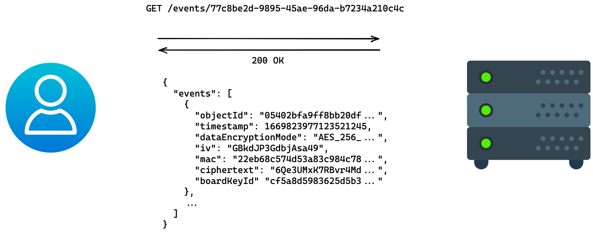

# API Spezifikation + User Flows

Die aktuelle API-Spezifikation ist unter folgender Quelle zu finden:
<https://github.com/neXenio/kbls-pqc-demonstrator-api>.
Die folgenden User Flows beschreiben, wie die API verwendet wird.

> Im Folgenden wird für hybride Schlüsselpaare der Einfachheit halber angenommen, dass sie aus einem
> Kyber-Schlüsselpaar und einem RSA-Schlüsselpaar bestehen.
>
> Die Mechanismen sind so konzipiert, dass Kyber durch ein anderes quantenresistentes Verfahren ersetzt werden kann
> (bspw. McEliece) und RSA durch ein anderes klassisches Verfahren ersetzt werden kann (bspw. eine geeignete
> Elliptic-Curve-Variante). Technisch lässt sich auch RSA mit EC kombinieren, aber dies hat keinen praktischen Nutzen in
> Bezug auf die Quantencomputerresistenz.

## Nutzer registrieren

Am bestehenden Prozess der Nutzerregistrierung ändert sich nichts. Für die beschriebenen Funktionalitäten müssen aber
für jeden Nutzer zwei Schlüsselpaare registriert werden. Die Verknüpfung erfolgt über die User-ID, die bei der
Registrierung des Nutzers festgelegt wird (bspw. die E-Mail-Adresse).


## Schlüsselpaare registrieren

Jeder Nutzer benötigt für die beschriebenen Funktionalitäten zwei Schlüsselpaare, die clientseitig generiert und
serverseitig persistiert werden. Jedes Schlüsselpaar enthält einen geheimen Schlüssel, der clientseitig verschlüsselt
wird, damit er serverseitig nicht ausgelesen werden kann.

Dieser Prozess wird auch verwendet, um alte Schlüsselpaare durch neue abzulösen. Will ein Nutzer beispielsweise ein RSA-Schlüsselpaar
durch ein EC-Schlüsselpaar ablösen, wird das aktuelle Kyber-Schlüsselpaar zusammen mit dem neuen EC-Schlüsselpaar registriert.
Zu beachten ist hierbei jedoch, dass aufgrund ihrer Natur die Schlüsselpaare jeweils nur mit der exakt gleichen Kombination
auf der Empfängerseite kommunizieren können. Ein vollständiger Wechsel benötigt daher eine Generierung neuer Schlüssel
aufseiten aller Kommunikationspartner. Eine einseitige Willenserklärung einen neuen Schlüssel zu verwenden kann dadurch
jedoch abgegeben und von einzelnen, kryptografisch kompatiblen Kommunikationspartnern honoriert werden.

Der genaue Prozess, wie diese Rotation im Falle einer signifikanten Verschlechterung des Schutzniveaus (etwa im Fall eines
neuen mathematischen Durchbruchs) schnell praktisch umgesetzt werden kann, ist nicht Teil dieses Konzepts. Auf die selbe
Weise können technisch auch beide Schlüsselpaare gleichzeitig abgelöst werden.

1. Generiere Schlüsselpaare und encryption salts

```python
# encryption salt
encryption_salt = random_bytes(16) # e.g. jv/DRgVf5WW5d5BTCyozOQ==

# Kyber
kyber_keypair = Kyber.gen_keypair()
kyber_public_key_base64 = kyber_keypair.public # e.g. MIIFQzCBlwYJKoZIhvcNAQMBMIGJ...
kyber_private_key_base64 = kyber_keypair.private # e.g. MIIKBQIBADCBlwYJKoZIhvcNAQM...

# RSA
rsa_keypair = RSA.gen_keypair()
rsa_public_key_base64 = rsa_keypair.public # e.g. MIICIjANBgkqhkiG9w0BAQEFAAOC...
rsa_private_key_base64 = rsa_keypair.private # e.g. MIIJRAIBADANBgkqhkiG9w0BAQE...
```

2. Encryption key für die geheimen Schlüssel ableiten aus dem Nutzerpasswort und encryption salts

```python
encryption_key        = pbkdf2(password, "encryptPrivateKeys" || encryption_salt)
iv                    = sha256(public key)
encrypted_private_key = aes256gcm.encrypt(private_key, encryption_key, iv)
```

> Der Wert `sha256(public_key)` wird auf 12 Bytes gestutzt, um der empfohlenen Größe für AES-GCM zu entsprechen.

3. Ergebnis als DTO encodieren (beispielhaft für Kyber)

```json
{
  "publicKey": {
    "publicKeyAlgorithm": "KYBER",
    "pkBase64": "MIIFQzCBlwYJKoZIhvcNAQMBMIGJ..."
  },
  "encryptedPrivateKey": {
    "skEncryptionAlgorithm": "AES_256_GCM_PBKDF2",
    "skCiphertext": "Rez0G6dTXc/Z6p7a9SB0noCR...",
    "skEncryptionSalt": "jv/DRgVf5WW5d5BTCyoz..."
  }
}
```

4. Key Pair DTOs mit user-ID aggregieren und an den Server schicken


> Das encryption salt für die Verschlüsselung des private keys ist aus kryptografischer Sicht an dieser Stelle
> redundant und unpräzise benannt:
>
> * Der resultierende encryption key wird nur je einmal pro KEM-Schlüsselpaar verwendet. Deshalb kann der IV hier ohne Sicherheitsbedenken
>   statisch je Schlüsselpaar sein und das salt für PBKDF2 aus dem public key abgeleitet werden (bspw.
>   sha256(public key)). Somit ist ein separates encryption salt nicht technisch erforderlich.
> * Das salt wird für PBKDF2 verwendet, nicht für die Verschlüsselung. Das Verschlüsseln bedingt aber PBKDF2 und damit das
>   salt.
> * Damit ein Passworthash mit PBKDF2, der in einem anderen Kontext genutzt wird, nicht zufällig dem encryption key entspricht,
>   wird der konstante String `encryptPrivateKeys` dem salt vorangestellt.
>
> Wir verwenden an dieser Stelle trotzdem ein separates salt, um einerseits versehentlichen Fehlern an anderer Stelle
> vorzubeugen und andererseits weitere Verschlüsselungsmodi ohne API-Anpassungen zu ermöglichen.

## Board erstellen

Die Erstellung eines Boards erfordert die Erstellung eines Board keys und dessen Verschlüsselung. Der Nutzer, der
dieses Board erstellt, teilt das Board gewissermaßen mit sich selbst. Im oben beschriebenen hybriden
Schlüsseleinigungsverfahren nimmt der Nutzer die Rolle von Alice und Bob ein.

1. Board ID und Board Key generieren (32 zufällige Bytes)

```python
board_id  = UUID.random()
board_key = random_bytes(32)
```

2. Erstes Geheimnis mit Kyber erstellen und verschlüsseln

```python
kyber_kem_result  = Kyber.kem(kyber_private_key_user, kyber_public_key_user)
secret1           = kyber_kem_result.secret
encrypted_secret1 = kyber_kem_result.encrypted_secret
```

3. Zweites Geheimnis mit RSA erstellen und verschlüsseln

```python
rsa_kem_result    = RSA.kem(rsa_private_key_user, rsa_public_key_user)
secret2           = rsa_kem_result.secret
encrypted_secret2 = rsa_kem_result.encrypted_secret
```

4. Board Key verschlüsseln

```python
key_encryption_key = hkdf(secret1 || secret2)
iv = sha256(board_id)
encrypted_board_key = aes256gcm.encrypt(board_key, key_encryption_key, iv)
```

> Der Wert `sha256(board_id)` wird auf 12 Bytes gestutzt, um der empfohlenen Größe für AES-GCM zu entsprechen.

5. IDs für die public keys erstellen

```python
id1 = sha256(kyber_public_key_user)
id2 = sha256(rsa_public_key_user)
```

6. Ergebnis als DTO encodieren

```json
{
  "boardId": "77c8be2d-9895-45ae-96da-b7234a210c4c",
  "source": { "id1": "59ec81ac05fdc91...", "id2": "06fafdfcc94157d..." },
  "target": { "id1": "59ec81ac05fdc91...", "id2": "06fafdfcc94157d..." },
  "encryptedBoardKey": "mW4mDrwpDcSvOBEDgBzN7DGKLd+FtRZViAIrDUCe3RTxNILBpv1kWQ==",
  "hybridEncryptionMode": "KYBER_768_RSA_4096",
  "encryptedKdfInput1": "MIIE4zCBlwYJKoZIhvcNAQMBMIGJAkEA...",
  "encryptedKdfInput2": "b5fwR9PJzjrA6TEx9ukiUXxvCSZp2h2e..."
}
```

7. Board Encryption Data DTO an den Server schicken


## Board bearbeiten

Sobald ein Board erstellt oder geöffnet ist, liegt die Board-ID sowie der Board key vor. Der IV für die Verschlüsselung des
jeweiligen Post-it-Inhalts wird zufällig vom Client bestimmt. Jedes erstellte Post-it erhält eine eindeutige ID. Jede Änderung
an einem Post-it wird mit einem aktuellen Zeitstempel versehen.

Weil sich der Board key im Laufe der Zeit ändern kann, wird zudem der Board key referenziert, mit dem der Post-it-Inhalt
verschlüsselt wurde.

Änderungen können in Batches an den Server geschickt werden.

1. Post-it-Inhalt

```python
# given: board_key, postit_id, postit_content
timestamp                = now()
iv                       = random_bytes(12)
encryption_key           = hkdf(board_key, "ENC")
authentication_key       = hkdf(board_key, "AUTH")
encrypted_postit_content = aes256ctr.encrypt(postit_content, encryption_key, iv)
encryption_mac           = hmac(encrypted_postit_content, authentication_key)
board_key_id             = sha256(board_key)
```

2. Ergebnis als DTO encodieren

```json
{
  "objectId": "05402bfa9ff8bb20df8f29776e32c80c51b8fda88e1216b09fa54b5c9c5b3fd7",
  "timestamp": 1669823977123521245,
  "dataEncryptionMode": "AES_256_CTR_HMAC_SHA256",
  "iv": "GBkdJP3GdbjAsa49",
  "ciphertext": "6Qe3UMxK7RBvr4Md9kV2+2VW2I3tsoAIaSci8nrZ/bp8HfLL4VG2zQ==",
  "mac": "22eb68c574d53a83c984c785a94680130b4f94bfd530167c993b3db83f8aa1b1",
  "boardKeyId": "cf5a8d5983625d5b3c662a843720aa387d41e8a9d8d4964d1e72a24021ce32f0"
}
```

3. Änderungen aggregieren und an den Server schicken
<!-- https://excalidraw.com/#json=x04kjo7fDurdefJud1BaL,ptFPOFhUBPh734af8HsoEA -->


## Board öffnen

Voraussetzung für eine Nutzerin Alice, ein Board zu öffnen, ist, dass das Board erstellt und mit Alice geteilt wurde.
Wir nehmen der Einfachheit halber an, Alice hat das Board selber erstellt und damit bereits mit sich selbst geteilt.
Zur besseren Veranschaulichung dieses Prozesses nehmen wir zudem an, dass Alice den Client seitdem neu gestartet hat
und lediglich ihre Zugangsdaten kennt.

Um das Board zu öffnen, muss zuerst der Board Key entschlüsselt werden. Dazu sind einerseits die geheimen Schlüssel des
Nutzers erforderlich und andererseits der verschlüsselte Board key. Alice holt sich beides vom Server:

1. Abrufen vom hybriden Schlüsselpaar beim Server


```python
user_id_alice               = "alice@acme.com"
hybrid_key_pair             = request("GET", "/keys/{user_id_alice}")
encrypted_kyber_private_key = hybrid_key_pair.keyPair1.encryptedPrivateKey
encrypted_rsa_private_key   = hybrid_key_pair.keyPair2.encryptedPrivateKey
```

2. Entschlüsseln der geheimen Schlüssel

```python
kyber_encryption_salt = encrypted_kyber_private_key.encryption_salt
kyber_encryption_key  = pbkdf2(password, kyber_encryption_salt)
kyber_ciphertext      = encrypted_kyber_private_key.skCiphertext
kyber_iv              = sha256(kyber_public_key)
kyber_private_key     = aes256gcm.decrypt(kyber_ciphertext, kyber_encryption_key, kyber_iv)

rsa_encryption_salt = encrypted_rsa_private_key.encryption_salt
rsa_encryption_key  = pbkdf2(password, rsa_encryption_salt)
rsa_ciphertext      = encrypted_rsa_private_key.skCiphertext
rsa_iv              = sha256(rsa_public_key)
rsa_private_key     = aes256gcm.decrypt(rsa_ciphertext, rsa_encryption_key, rsa_iv)
```

> Die Werte `sha256(*_public_key)` werden auf 12 Bytes gestutzt, um der empfohlenen Größe für AES-GCM zu entsprechen.

3. Abrufen aller für Alice verschlüsselten Board keys beim Server, weitere Schritte exemplarisch für den ersten Board key


```python
id1 = sha256(kyber_public_key)
id2 = sha256(rsa_public_key)

all_board_key_encryption_data = request("GET", "/boards/?id1={id1}&id2={id2}")
board_key_encryption_data     = all_board_key_encryption_data.encryptionDataList.[0]

board_id   = board_key_encryption_data.boardId
source_id1 = board_key_encryption_data.source.id1
source_id2 = board_key_encryption_data.source.id2

source_hybrid_public_key = request("GET", "/keys/?id1={source_id1}&id2={source_id2}")
source_kyber_public_key  = source_hybrid_public_key.pk1
source_rsa_public_key    = source_hybrid_public_key.pk2
```

4. Entschlüsseln des Board keys

```python
enc_kdf_input1 = board_key_encryption_data.encryptedKdfInput1
enc_kdf_input2 = board_key_encryption_data.encryptedKdfInput2
kdf_input1     = Kyber.decrypt(enc_kdf_input1, kyber_private_key, source_kyber_public_key)
kdf_input2     = RSA.decrypt(enc_kdf_input2, rsa_private_key, source_rsa_public_key)

encryption_key = hkdf(kdf_input1 || kdf_input2)
iv             = sha256(board_id)

enc_board_key = board_key_encryption_data.encryptedBoardKey
board_key     = aes256gcm.decrypt(enc_board_key, encryption_key, iv)
board_key_id  = sha256(board_key)
```

> Der Wert `sha256(board_id)` wird auf 12 Bytes gestutzt, um der empfohlenen Größe für AES-GCM zu entsprechen.

5. Abrufen aller Post-it-Inhalte beim Server mit anschließender MAC-Validierung und Entschlüsselung.

<!-- https://excalidraw.com/#json=VtA_sS3ON0MswyHYhO4gO,RE1zG5GBnTNcUvPZWTDgSw -->


```python
board_events = request("GET", "/events/{board_id}")

same_board_key_id = lambda board_event: board_event.boardKeyId == board_key_id
events_encrypted_for_board_key = filter(same_board_key_id, board_events)

for board_event in events_encrypted_for_board_key:
  ciphertext         = board_event.ciphertext
  iv                 = board_event.iv
  mac                = board_event.mac
  encryption_key     = hkdf(board_key, "ENC")
  authentication_key = hkdf(board_key, "AUTH")
  hmac_validation    = constant_time_equals(mac, hmac(ciphertext, authentication_key)) 
  assert(hmac_validation)

  board_event_data   = aes256ctr.decrypt(ciphertext, encryption_key, iv)
```

## Board mit anderen Nutzern teilen

Der Prozess, ein Board mit einem anderen Nutzer zu teilen, ist im Wesentlichen der gleiche wie der Prozess, ein Board
zu erstellen. Die einladende Nutzerin heißt im folgenden Alice, der eingeladene Nutzer heißt Bob.

Der Prozess für Bob, das Board anschließend zu öffnen, ist der gleiche wie für Alice bereits oben beschrieben ist.

1. Alice kennt die Board ID und den Board Key
2. Erstes Geheimnis mit Kyber erstellen und verschlüsseln

```python
kyber_kem_result  = Kyber.kem(kyber_private_key_alice, kyber_public_key_bob)
secret1           = kyber_kem_result.secret
encrypted_secret1 = kyber_kem_result.encrypted_secret
```

3. Zweites Geheimnis mit RSA erstellen

```python
rsa_kem_result    = RSA.kem(rsa_private_key_alice, rsa_public_key_bob)
secret2           = rsa_kem_result.secret
encrypted_secret2 = rsa_kem_result.encrypted_secret
```

4. Board key verschlüsseln

```python
key_encryption_key  = hkdf(secret1 || secret2)
iv                  = sha256(board_id)
encrypted_board_key = aes256gcm.encrypt(board_key, key_encryption_key, iv)
```

> Der Wert `sha256(board_id)` wird auf 12 Bytes gestutzt, um der empfohlenen Größe für AES-GCM zu entsprechen.

5. IDs für die public keys erstellen

```python
id1_source = sha256(kyber_public_key_alice)
id2_source = sha256(rsa_public_key_alice)
id1_target = sha256(kyber_public_key_bob)
id2_target = sha256(rsa_public_key_bob)
```

6. Ergebnis als DTO encodieren

```json
{
  "boardId": "77c8be2d-9895-45ae-96da-b7234a210c4c",
  "source": { "id1": "59ec81ac05fdc91...", "id2": "06fafdfcc94157d..." },
  "target": { "id1": "afb702e1abc4c77...", "id2": "8a885ac0dff6161..." },
  "encryptedBoardKey": "2dbDmY3h+OyV4MDNoeDC7zwb0NuIt/5UY2tIndhwD1slRSRt2QdYgA==",
  "hybridEncryptionMode": "KYBER_768_RSA_4096",
  "encryptedKdfInput1": "YjVmd1I5UEp6anJBNlRFeDl1a2lVWHh2...",
  "encryptedKdfInput2": "OGE4ODVhYzBkZmY2MTYxMTRiODk4NzA4..."
}
```

7. Board Encryption Data DTO an den Server schicken


## Zugriffsrechte für ein Board entziehen

Wenn Nutzern die Zugriffsrechte entzogen werden, müssen alle künftigen Post-it-Inhalte auf eine andere Weise
verschlüsselt werden, um das Schutzziel weiterhin zu erfüllen. Dazu wird ein neuer Board key erstellt und verteilt.
Dieser Prozess funktioniert weitestgehend wie die Prozesse für das Erstellen und Teilen des Boards.

1. Neuen Board Key generieren (32 zufällige Bytes)

```python
new_board_key = random_bytes(32)
```

2. Erstes Geheimnis mit Kyber erstellen

```python
kyber_kem_result  = Kyber.kem(kyber_private_key_user, kyber_public_key_user)
secret1           = kyber_kem_result.secret
encrypted_secret1 = kyber_kem_result.encrypted_secret
```

3. Zweites Geheimnis mit RSA erstellen

```python
rsa_kem_result    = RSA.kem(rsa_private_key_user, rsa_public_key_user)
secret2           = rsa_kem_result.secret
encrypted_secret2 = rsa_kem_result.encrypted_secret
```

4. Board Key verschlüsseln

```python
key_encryption_key  = HKDF(secret1 || secret2)
iv                  = sha256(board_id)
encrypted_board_key = aes256gcm.encrypt(board_key, key_encryption_key, iv)
```

> Der Wert `sha256(board_id)` wird auf 12 Bytes gestutzt, um der empfohlenen Größe für AES-GCM zu entsprechen.

5. IDs für die public keys erstellen

```python
id1 = sha256(kyber_public_key_user)
id2 = sha256(rsa_public_key_user)
```

6. Ergebnis als DTO encodieren

```json
{
  "boardId": "77c8be2d-9895-45ae-96da-b7234a210c4c",
  "source": { "id1": "59ec81ac05fdc91...", "id2": "06fafdfcc94157d..." },
  "target": { "id1": "59ec81ac05fdc91...", "id2": "06fafdfcc94157d..." },
  "encryptedBoardKey": "mW4mDrwpDcSvOBEDgBzN7DGKLd+FtRZViAIrDUCe3RTxNILBpv1kWQ==",
  "hybridEncryptionMode": "KYBER_768_RSA_4096",
  "encryptedKdfInput1": "MIIE4zCBlwYJKoZIhvcNAQMBMIGJAkEA...",
  "encryptedKdfInput2": "b5fwR9PJzjrA6TEx9ukiUXxvCSZp2h2e..."
}
```

7. Board Encryption Data DTO an den Server schicken

```
TODO: image
```

8. Schritte 2-7 für alle Nutzer mit Zugriffsrechten wiederholen - exklusive aller Nutzer, deren Zugriffsrechte entzogen
   wurden.
9. Server informieren, dass der Board key gewechselt wurde

```
TODO: image
```

> Schritt 9 stellt sicher, dass der alte Board key nicht weiterhin benutzt wird. Anschließend verhindert der Server das
> Hinzufügen von Änderungen, die unter einem anderen Board key verschlüsselt wurden.
>
> Es ist möglich, dass in der Übergangszeit, also in der Zeit zwischen Schritt 1 und Schritt 9, weitere Post-it-Inhalte
> unter dem alten Board key verschlüsselt und gepostet werden. Die initiale Absicht, weitere Post-it-Inhalte
> unzugänglich zu machen, wird also erst mit etwas Verzögerung technisch durchgesetzt.
>
> Nach Schritt 9 müssen alle Clients den neuen Board key beim Server erfragen, siehe dazu den Workflow "Board öffnen".
