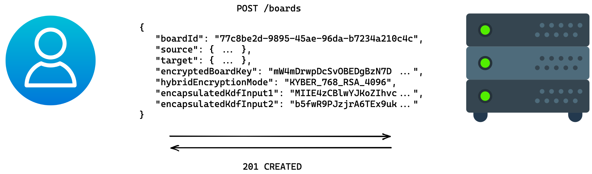
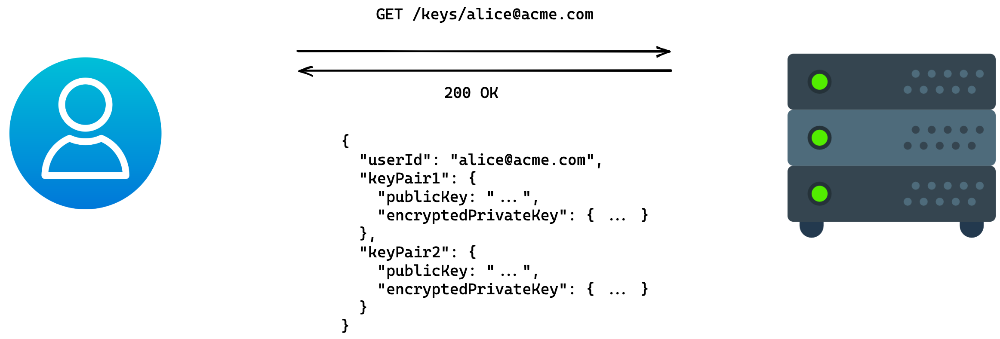
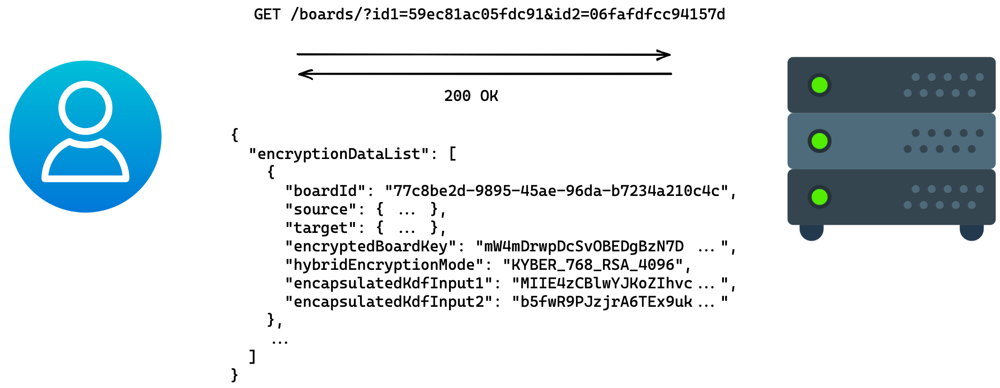

# API Specification + User Flows

The following user flows describe how the clients interact with the server. Exemplary endpoints and DTOs are provided.

> In the following, hybrid key pairs are assumed to consist of a Kyber key pair and an RSA key pair for simplicity.
>
> The mechanisms are designed in such a way that Kyber can be replaced by another quantum resistant method (e.g. McEliece)
> and RSA can be replaced by another classical method (e.g. a suitable elliptic curve variant). Technically, RSA can also
> be combined with EC, but this has no practical use in relation to quantum computing.

## User registration

Nothing changes in the existing process of user registration. For the described functionalities, however, two key pairs
must be registered for each user. The link is made via the user ID, which is defined during the registration (e.g. the e-mail
address).


## Key pair registration

All users need two key pairs for the described functionalities, which are generated on the client side and persisted on
the server side. Each key pair contains a private key that is encrypted on the client side so that it cannot be read on
the server side.

This process is also used to replace old key pairs with new ones. For example, if an RSA key pair is to be replaces by an
EC key pair, the current Kyber key pair is registered together with the new EC key pair. It should be noted, however, that
due to their nature, the key pairs can only communicate with the exact same combination on the receiver side. A complete
change therefore requires the generation of new keys on the part of all communication partners. A unilateral declaration
of intent to use a new key can, however, be expressed and can be honored by individual, cryptographically compatible
communication partners.

The exact process of how this rotation is performed in case of a significant degradation of the protection level (e.g.,
in case of a new mathematical breakthrough) is not part of this concept. In the same way, both key pairs can technically
be replaced at the same time.

1. Generate key pairs and salt to derive encryption keys.

```python
# Kyber
kyber_keypair            = Kyber.gen_keypair()
kyber_public_key_base64  = kyber_keypair.public # e.g. MIIFQzCBlwYJKoZIhvcNAQMBMIGJ...
kyber_private_key_base64 = kyber_keypair.private # e.g. MIIKBQIBADCBlwYJKoZIhvcNAQM...
kyber_encryption_salt    = random_bytes(16) # e.g. jv/DRgVf5WW5d5BTCyozOQ==

# RSA
rsa_keypair              = RSA.gen_keypair()
rsa_public_key_base64    = rsa_keypair.public # e.g. MIICIjANBgkqhkiG9w0BAQEFAAOC...
rsa_private_key_base64   = rsa_keypair.private # e.g. MIIJRAIBADANBgkqhkiG9w0BAQE...
rsa_encryption_salt      = random_bytes(16) # e.g. asdDRgVf5orcs5BTCyodea==
```

2. Derive symmetric keys for private key encryption from user password and salt.

```python
encryption_key        = pbkdf2(password, "encryptPrivateKeys" || encryption_salt)
iv                    = sha256(public_key)
encrypted_private_key = aes256gcm.encrypt(private_key, encryption_key, iv)
```

> Explanations:
> * The calculation is performed for Kyber and RSA, respectively, with the specific keys and salts.
> * The cryptographic functions used are PBKDF2, AES-256 in Galois counter mode (AES-GCM), and SHA-256.
> * The `password` value is determined by the user and is independent of the user password used at login.
> * The `encryption_salt` value consists of 16 bytes generated by a suitable random number generator, and is stored
>   together with `encrypted_private_key` at the server.
> * The constant string `encryptPrivateKeys` is used to provide domain separation, so that for example a PBKDF2 password
>   hash stored at the auth server does not match the symmetric `encryption_key`. For this purpose the string is concatenated
>   with the salt (`||`).
> * The `sha256(public_key)` value is truncated to 12 bytes to match the recommended size for AES-GCM.

> Remarks:
> * This approach allows an offline attack on the `password` by the server or someone who compromises the server. 
>   PBKDF2 should be configured to make such attacks particularly inefficient (e.g., by using at least 100,000 internal
>   iterations - preferably even more). Additionally, users should be encouraged to use strong passwords (no reuse, high
>   entropy). Last but not least, an important protection mechanism at this point is the assumption that the server is not
>   acting maliciously and is protected against attacks.
> * The `encryption_salt` value is required to prevent precomputation of keys associated to weak passwords. To ensure the
>   security of changing passwords, when a password is changed the salt is also reselected.
> * The `encryption_salt` value is imprecisely named from a cryptographic point of view: The salt is used for PBKDF2, not for
>   the encryption. However, encryption requires PBKDF2 and thus the salt.

3. Encode result as DTO (example for Kyber).

```json
{
  "publicKey": {
    "publicKeyAlgorithm": "KYBER",
    "pkBase64": "MIIFQzCBlwYJKoZIhvcNAQMBMIGJ..."
  },
  "encryptedPrivateKey": {
    "skEncryptionAlgorithm": "AES_256_GCM_PBKDF2",
    "skCiphertext": "Rez0G6dTXc/Z6p7a9SB0noCR...",
    "skEncryptionSalt": "jv/DRgVf5WW5d5BTCyoz..."
  }
}
```

4. Aggregate key pair DTOs with user ID and send to server.


## Create board

Creating a board requires a board key and its encryption. The person who creates this board, in a sense, shares the board
with himself. In the hybrid key agreement process described above, this person takes on the roles of both Alice and Bob.

1. Generate board ID (UUID Version 4) and board key (32 random bytes).

```python
board_id  = UUID.random()
board_key = random_bytes(32)
```

2. Generate and encapsulate a first secret with Kyber.

```python
kyber_kem_result     = Kyber.encapsulate(kyber_private_key_user, kyber_public_key_user)
secret1              = kyber_kem_result.secret
encapsulated_secret1 = kyber_kem_result.encapsulated_secret
```

3. Generate and encapsulate a second secret with RSA.

```python
rsa_kem_result       = RSA.encapsulate(rsa_private_key_user, rsa_public_key_user)
secret2              = rsa_kem_result.secret
encapsulated_secret2 = rsa_kem_result.encapsulated_secret
```

4. Encrypt the board key.

```python
key_encryption_key  = hkdf(secret1 || secret2, "aes-key")
encrypted_board_key = aes256kw.encrypt(board_key, key_encryption_key)
```

> Explanations:
> * The cryptographic functions used are HKDF and AES-256 in key-wrap mode (KW).
> * The byte arrays corresponding to `secret1` and `secret2` are concatenated (`||`).

> Notes:
> * The parameter `salt` for HKDF is an empty byte array, because the inputs are only used here. For domain separation we
>   use the value `"aes-key"` for the parameter `info`.

5. Derive IDs for the public keys.

```python
id1 = sha256(kyber_public_key_user)
id2 = sha256(rsa_public_key_user)
```

6. Encode the result as DTO.

```json
{
  "boardId": "77c8be2d-9895-45ae-96da-b7234a210c4c",
  "source": { "id1": "59ec81ac05fdc91...", "id2": "06fafdfcc94157d..." },
  "target": { "id1": "59ec81ac05fdc91...", "id2": "06fafdfcc94157d..." },
  "encryptedBoardKey": "mW4mDrwpDcSvOBEDgBzN7DGKLd+FtRZViAIrDUCe3RTxNILBpv1kWQ==",
  "hybridEncryptionMode": "KYBER_768_RSA_4096",
  "encapsulatedKdfInput1": "MIIE4zCBlwYJKoZIhvcNAQMBMIGJAkEA...",
  "encapsulatedKdfInput2": "b5fwR9PJzjrA6TEx9ukiUXxvCSZp2h2e..."
}
```

7. Send board encryption data DTO to the server.

<!-- https://excalidraw.com/#json=_Gr_3et1YlCPk8a0_dK7O,tsi_E4CB4UnCOKEBGRU3Dw -->


## Edit board

When a board is created or opened, the board ID and the board key are available. The IV for the encryption of the content
is determined randomly by the client. Each post-it created is assigned a unique ID. Every change to a post-it is provided
with a current timestamp.

Because the board key can change over time, the board key used to encrypt the post-it content is also referenced.

Changes can be sent to the server in batches.

1. Post-it content:

```python
# given: board_key, postit_id, postit_content
timestamp                = now()
iv                       = random_bytes(12)
encryption_key           = hkdf(board_key, "ENC")
authentication_key       = hkdf(board_key, "AUTH")
encrypted_postit_content = aes256ctr.encrypt(postit_content, encryption_key, iv)
encryption_mac           = hmac(encrypted_postit_content, authentication_key)
board_key_id             = sha256(board_key)
```

> Notes:
> * `"ENC"` and `"AUTH"` are the values for the HKDF parameter `info`.

2. Encode result as DTO.

```json
{
  "objectId": "05402bfa9ff8bb20df8f29776e32c80c51b8fda88e1216b09fa54b5c9c5b3fd7",
  "timestamp": 1669823977123521245,
  "dataEncryptionMode": "AES_256_CTR_HMAC_SHA256",
  "iv": "GBkdJP3GdbjAsa49",
  "ciphertext": "6Qe3UMxK7RBvr4Md9kV2+2VW2I3tsoAIaSci8nrZ/bp8HfLL4VG2zQ==",
  "mac": "22eb68c574d53a83c984c785a94680130b4f94bfd530167c993b3db83f8aa1b1",
  "boardKeyId": "cf5a8d5983625d5b3c662a843720aa387d41e8a9d8d4964d1e72a24021ce32f0"
}
```

> The `objectId` is the ID of the post-it and is determined by the client. This can either be a UUID or a hash value
> suitable hash value, e.g. from the concatenation of `iv` and `mac` when the post-it was first created. The advantage
> of the hash value is that it represents a [natural key](https://en.wikipedia.org/wiki/Natural_key). In contrast, the
> UUID represents a [surrogate key](https://en.wikipedia.org/wiki/Surrogate_key).

3. Aggregate changes and send them to the server.
<!-- https://excalidraw.com/#json=2Pcid6KT0qRRxur-rGujX,cw6Gc_DXPH9AWOQqwk2G2w -->


> The `/events/{boardId}` endpoint is used to send post-it content to the server. Each creation or change of a post-it is
> modeled as an event. Multiple events can be sent to the server at the same time, to use the network connection more
> efficiently ("batching").
>
> It is important that the timestamp is as precise as possible, or at least honest with the other board members, since the
> timestamp can be used to determine the order of events. However, in the end it is the decision of the server whether
> * all events are stored and sorted according to their timestamp or 
> * only the event that the server has received last is stored ("last write wins") or
> * the `objectId` is used as a parent ID, so that chains (or trees) of events are modeled.

## Open board

A prerequisite for a user Alice to open a board is that the board has been created and shared with Alice. For simplicity,
we assume that Alice has created the board herself and thus has already shared it with herself. To better illustrate this
process, we also assume that Alice has since restarted the client and only knows her credentials.

To open the board, the board key must first be decrypted. This requires the private user keys on the one hand and the
encrypted board key. Alice fetches both from the server:

1. Request hybrid key pairs from the server.

<!-- https://excalidraw.com/#json=CQsHUH2fqRvj5dkWqDrfb,XwEv0EoCLbBJSYJUYGpoAw -->


```python
user_id_alice               = "alice@acme.com"
hybrid_key_pair             = request("GET", "/keys/{user_id_alice}")
kyber_public_key            = hybrid_key_pair.keyPair1.publicKey.pkBase64
encrypted_kyber_private_key = hybrid_key_pair.keyPair1.encryptedPrivateKey
rsa_public_key              = hybrid_key_pair.keyPair2.publicKey.pkBase64
encrypted_rsa_private_key   = hybrid_key_pair.keyPair2.encryptedPrivateKey
```

> Note: specifying the e-mail address in the URL is only exemplary here; a security-conscious implementation should protect
> this information. This is possible, for example, by using UUIDs for `userId` or by passing the email address in the request body.

2. Decrypt private keys.

```python
# Kyber
kyber_encryption_salt = encrypted_kyber_private_key.encryption_salt
kyber_encryption_key  = pbkdf2(password, "encryptPrivateKeys" || kyber_encryption_salt)
kyber_ciphertext      = encrypted_kyber_private_key.skCiphertext
kyber_iv              = sha256(kyber_public_key)
kyber_private_key     = aes256gcm.decrypt(kyber_ciphertext, kyber_encryption_key, kyber_iv)

# RSA
rsa_encryption_salt   = encrypted_rsa_private_key.encryption_salt
rsa_encryption_key    = pbkdf2(password, "encryptPrivateKeys" || rsa_encryption_salt)
rsa_ciphertext        = encrypted_rsa_private_key.skCiphertext
rsa_iv                = sha256(rsa_public_key)
rsa_private_key       = aes256gcm.decrypt(rsa_ciphertext, rsa_encryption_key, rsa_iv)
```

> Explanations:
> * The `password` value must be correctly specified by Alice, but is never transmitted to the server.
> * The `sha256(*_public_key)` values are truncated to 12 bytes to match the recommended size for AES-GCM.
> * The constant string `"encryptPrivateKeys"` is used to provide domain separation so that an e.g. PBKDF2 password hash
>   stored at the auth server does not match the symmetric `encryption_key`. For this purpose the string is concatenated
>   with the salt (`||`).

3. Retrieve all board keys encrypted for Alice from the server, further steps exemplary for the first board key.

<!-- https://excalidraw.com/#json=9y47_3FI5hAhwlSmuZwky,3RQOgtO9kyJQNXRsj2BAHg -->


```python
id1 = sha256(kyber_public_key)
id2 = sha256(rsa_public_key)

all_board_key_encryption_data = request("GET", "/boards/?id1={id1}&id2={id2}")
board_key_encryption_data     = all_board_key_encryption_data.encryptionDataList.[0]

board_id   = board_key_encryption_data.boardId
source_id1 = board_key_encryption_data.source.id1
source_id2 = board_key_encryption_data.source.id2

source_hybrid_public_key = request("GET", "/keys/?id1={source_id1}&id2={source_id2}")
source_kyber_public_key  = source_hybrid_public_key.pk1
source_rsa_public_key    = source_hybrid_public_key.pk2
```

4. Decrypt board key.

```python
enc_kdf_input1 = board_key_encryption_data.encapsulatedKdfInput1
enc_kdf_input2 = board_key_encryption_data.encapsulatedKdfInput2
kdf_input1     = Kyber.decapsulate(enc_kdf_input1, kyber_private_key, source_kyber_public_key)
kdf_input2     = RSA.decapsulate(enc_kdf_input2, rsa_private_key, source_rsa_public_key)

encryption_key = hkdf(kdf_input1 || kdf_input2, "aes-key")

enc_board_key = board_key_encryption_data.encryptedBoardKey
board_key     = aes256kw.decrypt(enc_board_key, encryption_key)
board_key_id  = sha256(board_key)
```

5. Retrieve all post-it content from the server, then validate MAC and decrypt.

<!-- https://excalidraw.com/#json=HLgMPuJHEfTYKnTRgMp7O,FTQWYGJQEEAlQm2ycF1hVA -->


```python
board_events = request("GET", "/events/{board_id}")

same_board_key_id = lambda board_event: board_event.boardKeyId == board_key_id
events_encrypted_for_board_key = filter(same_board_key_id, board_events)

for board_event in events_encrypted_for_board_key:
  ciphertext         = board_event.ciphertext
  iv                 = board_event.iv
  mac                = board_event.mac
  encryption_key     = hkdf(board_key, "ENC")
  authentication_key = hkdf(board_key, "AUTH")
  hmac_validation    = constant_time_equals(mac, hmac(ciphertext, authentication_key)) 
  assert(hmac_validation)

  board_event_data   = aes256ctr.decrypt(ciphertext, encryption_key, iv)
```

> This step is performed analogously for all board keys.

## Share board with other users

The process of sharing a board with other users is essentially the same as the process of creating a board. The inviting
user is called Alice in the following, the invited user is called Bob.

The process for Bob to open the board afterwards is the same as described above for Alice.

1. Alice knows the board ID and the board key.

2. Generate and encapsulate a first secret with Kyber.

```python
kyber_kem_result     = Kyber.encapsulate(kyber_private_key_alice, kyber_public_key_bob)
secret1              = kyber_kem_result.secret
encapsulated_secret1 = kyber_kem_result.encapsulated_secret
```

3. Generate and encapsulate a second secret with RSA.

```python
rsa_kem_result       = RSA.encapsulate(rsa_private_key_alice, rsa_public_key_bob)
secret2              = rsa_kem_result.secret
encapsulated_secret2 = rsa_kem_result.encapsulated_secret
```

4. Encrypt the board key.

```python
key_encryption_key  = hkdf(secret1 || secret2, "aes-key")
encrypted_board_key = aes256kw.encrypt(board_key, key_encryption_key)
```

5. Derive IDs for the public keys.

```python
id1_source = sha256(kyber_public_key_alice)
id2_source = sha256(rsa_public_key_alice)
id1_target = sha256(kyber_public_key_bob)
id2_target = sha256(rsa_public_key_bob)
```

6. Encode result as DTO.

```json
{
  "boardId": "77c8be2d-9895-45ae-96da-b7234a210c4c",
  "source": { "id1": "59ec81ac05fdc91...", "id2": "06fafdfcc94157d..." },
  "target": { "id1": "afb702e1abc4c77...", "id2": "8a885ac0dff6161..." },
  "encryptedBoardKey": "2dbDmY3h+OyV4MDNoeDC7zwb0NuIt/5UY2tIndhwD1slRSRt2QdYgA==",
  "hybridEncryptionMode": "KYBER_768_RSA_4096",
  "encapsulatedKdfInput1": "YjVmd1I5UEp6anJBNlRFeDl1a2lVWHh2...",
  "encapsulatedKdfInput2": "OGE4ODVhYzBkZmY2MTYxMTRiODk4NzA4..."
}
```

7. Send board encryption data DTO to the server.

<!-- https://excalidraw.com/#json=sZIO9HkI5-zdr6OW1Xb7C,Kf9d-e9PDS80VbS2aWX03g -->


> This process is performed for all board keys used on the board. The encryptions are performed analogously, but
> independently of each other. In particular, a new run of the KEM process is performed for each board key. Thus, all
> `key_encryption_key`s are different and the IV can be static.

## Share boards publicly

Public sharing of a board is an additional feature offered by neXboard. This function is not part of the core functionalities
of this concept, contradicts all security goals, and can only be implemented at the cost of performance. It should therefore
be used sparingly.

When a board is shared publicly, the requirement for its confidentiality and integrity no longer applies, since read and
write access to the board can be distributed arbitrarily. In particular, the server can also have such access. In order
to share a board publicly, then, it is therefore first shared with the server, which generates its own board-specific
(see the workflow [Key pair registration](#Key-pair-registration)). Users with access to the public link gain access to
the board-specific key material of the server and thus to the contents of the board. If the public link is disabled, this
is the same as the workflow for [Revoke access to a board](#revoke-access-to-a-board), where the server's access rights
are revoked.

> Note: The server acts as a proxy for all users who know the public link to the board. This can quickly become a bottleneck
> and make debugging difficult, so further measures should be taken:
> * capture alias for the user
> * additional protection of the link by password or expiration date
> * limit the number of parallel users
> * allow read-only access

## Revoke access to a board

If users have their access rights revoked, all future post-it content must be encrypted in a different way in order to still
meet the security goals. This is done by creating and distributing a new board key. This process works much like the processes
for creating and sharing the board.

1. Generate a new board key (32 random bytes).

```python
new_board_key = random_bytes(32)
```

2. Generate and encapsulate a first secret with Kyber.

```python
kyber_kem_result     = Kyber.encapsulate(kyber_private_key_user, kyber_public_key_user)
secret1              = kyber_kem_result.secret
encapsulated_secret1 = kyber_kem_result.encapsulated_secret
```

3. Generate and encapsulate a second secret with RSA.

```python
rsa_kem_result       = RSA.encapsulate(rsa_private_key_user, rsa_public_key_user)
secret2              = rsa_kem_result.secret
encapsulated_secret2 = rsa_kem_result.encapsulated_secret
```

4. Encrypt the board key.

```python
key_encryption_key  = hkdf(secret1 || secret2, "aes-key")
encrypted_board_key = aes256kw.encrypt(board_key, key_encryption_key)
```

5. Derive IDs for the public keys.

```python
id1 = sha256(kyber_public_key_user)
id2 = sha256(rsa_public_key_user)
```

6. Encode the result as DTO.

```json
{
  "boardId": "77c8be2d-9895-45ae-96da-b7234a210c4c",
  "source": { "id1": "59ec81ac05fdc91...", "id2": "06fafdfcc94157d..." },
  "target": { "id1": "59ec81ac05fdc91...", "id2": "06fafdfcc94157d..." },
  "encryptedBoardKey": "5oM1/ifWoEtHFOFfAtEqBaxrtaUo4kbOyBugx+BXY5umydX2uzt5iw==",
  "hybridEncryptionMode": "KYBER_768_RSA_4096", 
  "encapsulatedKdfInput1": "SCK275S3OHr1oTSeacxwg4SuBzHnnwNZ...",
  "encapsulatedKdfInput2": "7c1XMG0qGjU3XT0eybIXH1oHlVIAdMsj..."
}
```

7. Send board encryption data DTO to the server.

<!-- https://excalidraw.com/#json=ySe5gpwX7floIwkKN6dGo,B8KCa2-Ngtii24UEEC1uWw -->


8. Repeat steps 2-7 for all users with access rights - excluding all users whose access rights have been revoked.

9. Inform server that the board key has been rotated.

<!-- https://excalidraw.com/#json=ZMGQvkOaSupBLC5mCXSuU,l37K8on9DfLKWxlZ79Q8HQ -->


> Step 9 ensures that the old board key is no longer used. The server then rejects additions changes that were encrypted
> under a different board key.
>
> It is possible that during the transition period, i.e. the time between step 1 and step 9, additional post-it content may be
> encrypted and posted under the old board key. The initial intention to make further post-it content inaccessible is thus
> technically enforced only after some delay.
>
> After step 9, all clients must request the new board key from the server, see the [Open board](#open-board) workflow.

> Since in [Share board with other users](#share-board-with-other-users) all board keys are encrypted for the new users,
> in a naive implementation, it could happen that after Alice adds user Xavier and Bob simultaneously removes user Yve,
> Xavier will not have access to the new board key created by Bob. The result would not be security-critical, since it
> distributes less access than expected, but is obviously undesirable from a usability point of view. Therefore, neXboard
> implements a suitable locking mechanism that prevents or suitably resolves parallel changes to the set of user on a board.

## Change or reset passwort

Changing or resetting the password here refers to the password that the user selected during [Key pairs registration](#key-pair-registration).

### Change passwort

The process for changing a password is as follows:

1. Retrieve the hybrid key pairs from the server and then decrypt the private keys as described in [Open board](#open-board)
   steps 1-2.

```python
hybrid_key_pair             = request("GET", "/keys/{user_id}")
kyber_public_key            = hybrid_key_pair.keyPair1.publicKey.pkBase64
encrypted_kyber_private_key = hybrid_key_pair.keyPair1.encryptedPrivateKey
rsa_public_key              = hybrid_key_pair.keyPair2.publicKey.pkBase64
encrypted_rsa_private_key   = hybrid_key_pair.keyPair2.encryptedPrivateKey

# Kyber
kyber_encryption_salt       = encrypted_kyber_private_key.encryption_salt
kyber_encryption_key        = pbkdf2(password, "encryptPrivateKeys" || kyber_encryption_salt)
kyber_ciphertext            = encrypted_kyber_private_key.skCiphertext
kyber_iv                    = sha256(kyber_public_key)
kyber_private_key           = aes256gcm.decrypt(kyber_ciphertext, kyber_encryption_key, kyber_iv)

# RSA
rsa_encryption_salt         = encrypted_rsa_private_key.encryption_salt
rsa_encryption_key          = pbkdf2(password, "encryptPrivateKeys" || rsa_encryption_salt)
rsa_ciphertext              = encrypted_rsa_private_key.skCiphertext
rsa_iv                      = sha256(rsa_public_key)
rsa_private_key             = aes256gcm.decrypt(rsa_ciphertext, rsa_encryption_key, rsa_iv)
```

> Explanations:
> * The `password` value must be correctly specified by Alice, but is never transmitted to the server.
> * The `sha256(*_public_key)` values are truncated to 12 bytes to match the recommended size for AES-GCM.

2. Encrypt private key with new password and send to server as described in [Key pair registration](#key-pair-registration)
   steps 2-4.

```python
# Kyber
new_kyber_encryption_salt   = random_bytes(16)
new_kyber_encryption_key    = pbkdf2(new_password, "encryptPrivateKeys" || new_kyber_encryption_salt)
kyber_encrypted_private_key = aes256gcm.encrypt(kyber_private_key, new_kyber_encryption_key, kyber_iv)

# RSA
new_rsa_encryption_salt     = random_bytes(16)
new_rsa_encryption_key      = pbkdf2(new_password, "encryptPrivateKeys" || new_rsa_encryption_salt)
rsa_encrypted_private_key   = aes256gcm.encrypt(rsa_private_key, new_rsa_encryption_key, rsa_iv)

#...
request("POST", "/keys", hybrid_key_pair)
```

> Explanations:
> * The `*_encryption_salt` values must be renewed to limit the effectiveness of offline attacks.
> * The `new_password` value is determined by the user and is independent of the user password used at login.

### Reset password

It is technically impossible to reset a password, because the encrypted private keys can only be decrypted with the original
password - and only the affected user knows or knew the original password.

What is possible to a limited extent, however, is to regain access to existing boards. If a board was shared with another
user, that user can invite further users. The affected user wishing to reset the password, can therefore [register new key pairs](#key-pair-registration)
and be invited again. Access to boards that have not been shared cannot be restored.
